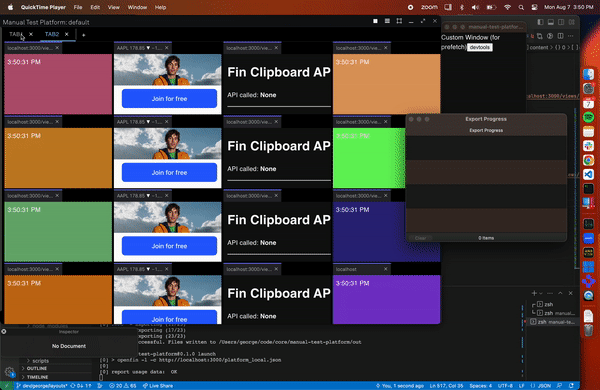

# OpenFin Multi-Layouts APIs

This is a sample showcasing how to leverage recent updates the OpenFin's Multi-Layout APIs. It was created as a [Next.js](https://nextjs.org/) project bootstrapped with [`create-next-app`](https://github.com/vercel/next.js/tree/canary/packages/create-next-app). An OpenFin application manifest was added at `public/multi-layout.json`. OpenFin is using the default Platform Provider (no HTML/js in this project for the platform provider). The logic for the Platform Window is in the `app` folder. All of the multi-layout logic is in `app/components/`.



### Release Notes

<b>This sample is using the pre-release version of OpenFin v34. This is not an LTS version and may contain bugs as it has not gone through a full QA / Release cycle.</b>

Current known issues with the new Multi-Layouts APIs:

- Upon initial launch, hidden layouts have not been resized and may jitter slightly the first time they are opened. This also happens when resizing the window and then switching to a different layout.
- Documentation has not been published yet. Please navigate to the type OpenFin.LayoutManager to see more info. You can find this info in node_modules/@openfin/core/out/mock.d.ts

### Bugs to be fixed by the Stable Release (LTS)

We plan on fixing these bugs before full LTS release.

- Initial launch slight jitter when switching tabs
- Calling `Layout.replace()` repeatedly in quick succession sometimes closes the platform
- Calling `Layout.replace()` repeatedly logs a warning that there is a listener leak
- Documentation will be updated + published

## Getting Started

First, install dependencies:

```bash
npm install
```

Then, build the Next.js app:

```bash
npm run build
```

Then, start the HTTP server:

```bash
npm start
```

Then, in a seperate terminal, launch the OpenFin platform:

```bash
npm run launch
```

This will launch the OpenFin platform, which will open up a single Platform Window as described in the manifest that contains 3 different layouts. In order to create another Window with multiple layouts, you can run `fin.Platform.getCurrentSync().createWindow()` with [window options](https://developer.openfin.co/docs/tsdoc/canary/interfaces/OpenFin.WindowCreationOptions.html) that includes a [layoutSnapshot](https://developer.openfin.co/docs/tsdoc/canary/interfaces/OpenFin.WindowCreationOptions.html#layoutSnapshot).

## CSS Recommendation for hidden layouts

It is recommended to use the `display: none` CSS setting to hide the divs for all inactive layouts. (We do not have anything planned for supporting `visibility: hidden` at this time.)

## Primary APIs

- `fin.Platform.Layout.init({ layoutManagerOverride })`
  - By supplying the override OpenFin no longer creates the layouts, Platform Providers are responsible for creating and destroying a Layout(s). In this override, Platform Providers will supply a class that implements the hook `applySnapshot` which will be called once the Platform Window is created.
- `fin.Platform.Layout.create({ layoutName, layout, container })`
  - Call this API once per layout. It is recommended to set your component state via the above `applySnapshot` override and in turn your layouts should react to the component state changes.
- `fin.Platform.Layout.destroy(layoutIdentity)`
  - Call this API when closing a layout.

# Optimizing content for Tabs

This repository demonstrates how usage of our new Multi-Layout API can improve your application’s Layout switching performance, compared to usage of `fin.Platform.Layout.replace()`. Content does not have to re-render in this Multi-Layout implementation, which results in significant visual and performance improvements when switching between Layouts.

### Process Affinity

By default, OpenFin Views share the same process affinity with other same-origin Views. This means that the Views share the same execution context (both main thread and memory). Given JavaScript’s single-threaded nature, rendering of multiple Views that share the same process affinity can lead to bottlenecks during memory-intensive operations, such as during creation, heavy user interaction, and – most relevant to this demo – tab switching.

OpenFin recommend's a new renderer process for every View in a Platform Provider's Layout. Platorms can achieve this by setting the key `platform.viewProcessAffinityStrategy` to “different” in the `platform` options in your manifest. (See [processAffinity docs](https://developer.openfin.co/docs/tsdoc/canary/interfaces/OpenFin.PlatformOptions.html#viewProcessAffinityStrategy)):

<i>app.manifest.json:</i>

```json
{
  ...
  "platform": {
    "uuid": "my-application-id",
    "name": "my-application-name",
    "viewProcessAffinityStrategy": "different",
    ...
  }
}
```

This ensures that every View created in the Platform will have its own Renderer Process, which should increase performance across the board, because memory and process space will no longer be shared among same-origin Views.

### Controlling for Application Content

Performance and rendering speed of the View content itself is just as important as the methodology used to transition from tab to tab. Web development best practices apply here, and a good resource is [Chrome’s Lighthouse](https://developer.chrome.com/docs/lighthouse/overview/). A performance score of < 80 can impact the performance or perceived performance of your application, especially when your Layout has a significant number of Views.

OpenFin also recommends that Platform Providers set the background color of their application content to match the background color of the Platform Window. This ensures that, even if the View content is in the process of loading, the UI will remain cohesive to the end user.

Additionally, be advised that your content could be doing something that forces re-renders. One example is an application using the [visibilitychange](https://developer.mozilla.org/en-US/docs/Web/API/Document/visibilitychange_event) event to re-render content. This is not a recommended best practice, and can be found in web applications such as [TradingView](https://www.tradingview.com/).

### Resource-constrained Machines

The Chromium engine employs a number of optimization techniques when running on machines with constrained resources. One of these optimizations involves reducing the total number of render processes, thereby forcing a number of applications into the same process affinity.

In extreme cases, you can experience dropping frames. This can be particularly noticeable on VMs with limited memory and CPUs, and no GPUs - as in [this video example](https://www.loom.com/share/8be3f7cf4dd44a8fa77cd008e20c4576?sid=29e1ea87-aa1c-4ce0-9d24-89c05636d5f0).

## Learn More

To learn more about Next.js, take a look at the following resources:

- [Next.js Documentation](https://nextjs.org/docs) - learn about Next.js features and API.
- [Learn Next.js](https://nextjs.org/learn) - an interactive Next.js tutorial.

You can check out [the Next.js GitHub repository](https://github.com/vercel/next.js/) - your feedback and contributions are welcome!
